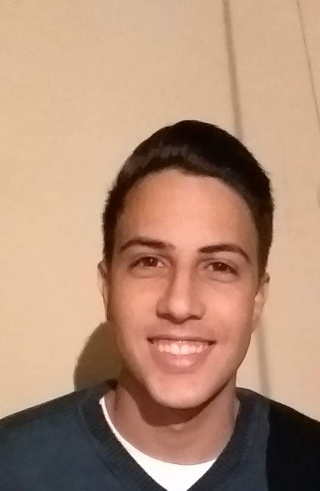

# Breve Currículo Pessoal

## Dados Pessoais

- Nome: Igor Freire de Morais
- Idade: 22 anos
- Cidade: Lavras, Minas Gerais
- Graduação: Cursando Ciência da computação na Universidade Federal de Lavras(Ufla) - 10° Período
- Email pessoal : igorfreire110@gmail.com
- [Linkedin](https://www.linkedin.com/in/igorfreire3/ "Meu Linkedin")
  

## Dados Profissionais

### Conhecimento

- HTML5
- CSS3
- Bootstrap
- JavaScript
- React
- Vue
- Scrum
- Breve conhecimento em Figma
- C++
- Java
- Python
- Git/Github

### Experiência Profissional

- Comp Júnior - Desenvolvedor Front-End | Maio/2021 até Novembro/2022
- Comp Júnior - Vice gerente de negócios e marketing| Janeiro/2022 até Setembro/2022
